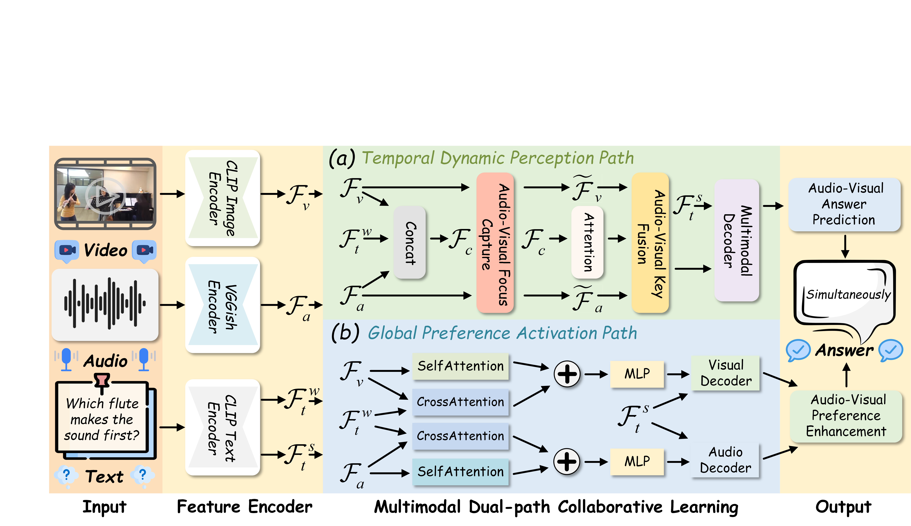

<div align="center">
<h2 class="papername"> AV-Master: Dual-Path Comprehensive Perception Makes Better
Audio-Visual Question Answering </h2>
<div>
    <a href="https://scholar.google.com/citations?user=Nt4QuMcAAAAJ&hl=zh-CN" target="_blank">Jiayu Zhang</a>,
    <a href="https://scholar.google.com/citations?user=1joiJpUAAAAJ&hl=zh-CN" target="_blank">Qilang Ye</a>,
    <a href="https://scholar.google.com.hk/citations?user=EWN-IogAAAAJ" target="_blank">Shuo Ye</a>, 
    <a href="https://scholar.google.com/citations?user=nHrEsbcAAAAJ&hl=zh-CN" target="_blank">Xun Lin</a>,
    <a href="https://github.com/Heisenberg10110" target="_blank"> Zihan Song</a>,
    <a href="https://scholar.google.com/citations?user=ziHejLwAAAAJ&hl=en" target="_blank">Zitong Yu*</a>
</div>

Great Bay University<br>
Nankai University<br>
Tsinghua University<br>
 Chinese University of Hong Kong<br>
*Corresponding author<br>
[](https://www.arxiv.org/abs/2510.18346)


</div>

</div>

## 🔥 If you find this work useful for your research, please kindly cite our paper and star our repo.

## 🔥 Introduction

This is the github repository of *UniEmo: Unifying Emotional Understanding and Generation with Learnable Expert Queries*. In this work, we introduce UniEmo, a unified framework that synergistically integrates emotional understanding and generation through a hierarchical understanding chain and dual generation‑driven feedback.
The whole framework of UniEmo:

<div align="center">

</div>

## 🔥 Details will be released. Stay tuned.

## 📝 Citation

```bib
@article{zhang2025av,
  title={AV-Master: Dual-Path Comprehensive Perception Makes Better Audio-Visual Question Answering},
  author={Zhang, Jiayu and Ye, Qilang and Ye, Shuo and Lin, Xun and Song, Zihan and Yu, Zitong},
  journal={arXiv e-prints},
  pages={arXiv--2510},
  year={2025}
}
