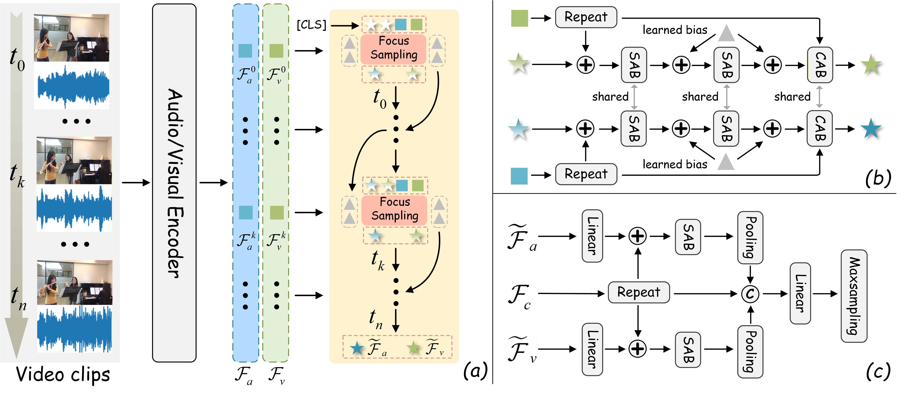

<div align="center">
<h2 class="papername"> AV-Master: Dual-Path Comprehensive Perception Makes Better
Audio-Visual Question Answering </h2>
<div>
    <a href="https://scholar.google.com/citations?user=Nt4QuMcAAAAJ&hl=zh-CN" target="_blank">Jiayu Zhang</a>,
    <a href="https://scholar.google.com/citations?user=1joiJpUAAAAJ&hl=zh-CN" target="_blank">Qilang Ye</a>,
    <a href="https://scholar.google.com.hk/citations?user=EWN-IogAAAAJ" target="_blank">Shuo Ye</a>, 
    <a href="https://scholar.google.com/citations?user=nHrEsbcAAAAJ&hl=zh-CN" target="_blank">Xun Lin</a>,
    <a href="https://github.com/Heisenberg10110" target="_blank"> Zihan Song</a>,
    <a href="https://scholar.google.com/citations?user=ziHejLwAAAAJ&hl=en" target="_blank">Zitong Yu*</a>
</div>

Great Bay University<br>
Nankai University<br>
Tsinghua University<br>
 Chinese University of Hong Kong<br>
*Corresponding author<br>
[](https://www.arxiv.org/abs/2510.18346)


</div>

</div>

## :loudspeaker: News 

- [04/2026] :fire: The code is released. Enjoy it!
- [10/2025] :fire: [arXiv paper](https://arxiv.org/abs/2510.18346) released! 

## :bulb: Introduction 

This is the github repository of *AV-Master: Dual-Path Comprehensive Perception Makes Better Audio-Visual Question Answering*. In this work, we propose AV-Master, a novel dual-path audio-visual question answering expert model designed to address the challenges faced by existing models in processing complex audio-visual scenes.
The whole framework of AV-Master:

<div align="center">

</div>


## 🛠️ Usage

1. **Clone this repo**

   ```python
   git clone https://github.com/AoKoo233/AV-Master.git
   ```

2. **Download data**

   MUSIC-AVQA: https://gewu-lab.github.io/MUSIC-AVQA/

   MUSIC-AVQA-v2.0: https://github.com/DragonLiu1995/MUSIC-AVQA-v2.0

   MUSIC-AVQA-R: https://github.com/mira-ai-lab/MUSIC-AVQA-R

   AVQA: http://mn.cs.tsinghua.edu.cn/avqa/

   Please prepare your dataset as the following structure (e.g., Music AVQA):

   ```
   dataset/music_avqa/
   ├── sub_test/
   │   ├── test_a_comp.json
   │   ├── test_a_count.json
   │   ├── ...
   │   ├── test_v_comp.json
   │   ├── ...
   │   └── test_av_temp.json
   ├── sub_val/
   │   ├── ...
   ├── test.json
   ├── train.json
   ├── val.json
   ```

3. **Training**

```
python main_train.py --batch-size 64 --epochs 30 --lr 1e-4 --gpu 0 --checkpoint AV_Master --use_word True --audios_feat_dir ./feats/Music-AVQA/vggish_audio --clip_qst_dir ./feats/Music-AVQA/clip_sentence_l14_336px --clip_vit_b32_dir ./feats/Music-AVQA/clip_vit_l14_336px --clip_word_dir ./feats/Music-AVQA/clip_word_l14_336px --clip_patch_dir ./feats/Music-AVQA/clip_patch_vit_l14_336px 
```

4. **Testing**

```
python main_test.py --gpu 0 --checkpoint AV_Master --use_word True --audios_feat_dir ./feats/Music-AVQA/vggish_audio --clip_qst_dir ./feats/Music-AVQA/clip_sentence_l14_336px --clip_vit_b32_dir ./feats/Music-AVQA/clip_vit_l14_336px --clip_word_dir ./feats/Music-AVQA/clip_word_l14_336px --clip_patch_dir ./feats/Music-AVQA/clip_patch_vit_l14_336px 
```

## 📝 Citation

```bib
@article{zhang2025av,
  title={AV-Master: Dual-Path Comprehensive Perception Makes Better Audio-Visual Question Answering},
  author={Zhang, Jiayu and Ye, Qilang and Ye, Shuo and Lin, Xun and Song, Zihan and Yu, Zitong},
  journal={arXiv preprint arXiv:2510.18346},
  year={2025}
}
```

## 🤗 Acknowledgement
* Lots of code are inherited from [PSTP-Net](https://github.com/GeWu-Lab/PSTP-Net) and [TSPM](https://github.com/gewu-lab/tspm). Thanks for all these great works.
